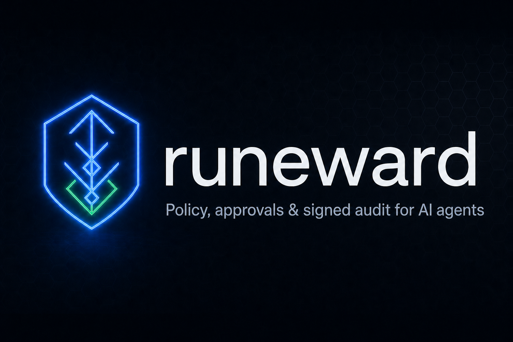
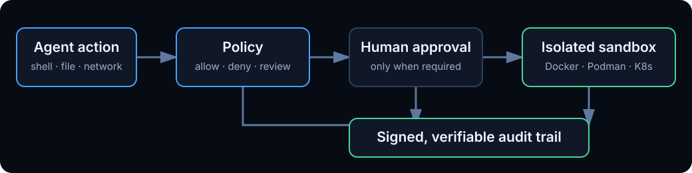

<p align="center">
  
</p>

<p align="center">
  <b>The open-source governance harness for AI agents.</b>
</p>

<p align="center">
  <a href="LICENSE"></a>
  <a href="https://github.com/Runewardd/runeward/actions/workflows/ci.yml"></a>
  <a href="go.mod"></a>
  <a href="https://github.com/Runewardd/runeward/releases"></a>
</p>

Put enforceable policy, human approvals, isolated execution, budgets, and signed evidence around
any AI agent. Runeward works with an existing agent or multi-agent framework rather than requiring
a new model or orchestration stack.

<p align="center">
  
</p>

## Prove it in one command

Prerequisites: a running Docker/Podman engine and the `runeward` binary.

```bash
runeward quickstart
```

The command creates `.runeward/quickstart.toml`, checks the policy, runtime, image, and state path,
runs an allowed command, proves a destructive command is denied before execution, and verifies the
signed audit trail. It never overwrites an existing policy unless `--force` is passed.

`doctor` and dashboard readiness also resolve required secret sources. A Charter that references an
unset `env://` value is not presented as launch-ready.

```bash
runeward doctor quickstart                     # explain setup problems safely
runeward --config-dir .runeward serve          # dashboard + governed REST API
runeward evidence export quickstart -o run.json
runeward evidence verify run.json              # independent policy/audit verification
```

## What Runeward adds

| Concern | Container alone | Runeward |
| --- | --- | --- |
| Tool calls | Executes what the process requests | Checks every shell, code, file, network, and browser action first |
| Risky actions | Application-specific | `allow`, `deny`, or `require-approval` with an attributed decision |
| Network | Usually open unless separately configured | Deny-by-default hostname policy; strict L3 enforcement on Kubernetes |
| Limits | CPU/memory | Wall-clock, exec, egress, token, cost, and retry-loop budgets |
| Audit | Runtime logs | Append-only, hash-chained, Ed25519-signed events |
| Handoff | Ad-hoc logs and folders | Workspace tar, recovery snapshots, and portable signed evidence JSON |
| Agent identity | One opaque process | Tenant, actor, parent run, provider, model, and durable run lineage |
| Interfaces | Runtime-specific | CLI, REST, MCP, web dashboard, Kubernetes CRDs, and local SDK adapters |

Every governed action follows one path:

```text
agent request → policy → human approval when required → limits → sandbox → signed audit event
```

## Naming

Documentation and UI use familiar terms first. Existing API paths and file fields retain the
original themed names for compatibility.

| Plain-language term | Runeward name | Existing surface |
| --- | --- | --- |
| Sandbox | Citadel | `/v1/citadels`, Kubernetes `Citadel` |
| Policy file/profile | Charter | `/v1/charters`, `*.toml` profile |
| Approvals | Conclave | `/v1/conclave` |
| Signed audit trail | Chronicle | `/v1/chronicle`, `[chronicle]` |
| Network controls | Perimeter | `/perimeter`, `[network]` |
| Budgets and limits | Rationing | `[rationing]` |
| Agent group/fleet | Cohort | `/v1/cohorts`, `[cohort]` |

See the full [naming and writing convention](docs/naming.md).

## Install

Choose the package that matches how you use Runeward:

| Install with | What it installs | Command |
| --- | --- | --- |
| [Homebrew](https://github.com/Runewardd/homebrew-tap) | Runeward CLI for macOS or Linux | `brew install Runewardd/tap/runeward` |
| [PyPI](https://pypi.org/project/runeward/) | Python client and agent-framework adapters | `python -m pip install runeward` |
| [npm](https://www.npmjs.com/package/@runeward/sdk) | TypeScript client and agent-framework tools | `npm install @runeward/sdk` |

For normal local use, install the CLI with Homebrew. For an agent integration, install the SDK for
its language as well. The pip and npm packages connect to a running Runeward API; they do not
replace the CLI/runtime.

### Homebrew — CLI

Local sandboxes require a running Docker, OrbStack, or Podman engine.

```bash
brew install Runewardd/tap/runeward
runeward version
runeward quickstart
```

### pip — Python SDK

Requires Python 3.9 or newer. The base client has no third-party runtime dependencies.

```bash
python -m pip install runeward
python -c "import runeward; print(runeward.__version__)"
```

### npm — TypeScript SDK

Requires Node.js 18 or newer.

```bash
npm install @runeward/sdk
npm ls @runeward/sdk
```

See [Adapters](docs/adapters.md) for LangChain, CrewAI, LlamaIndex, OpenAI Agents, Strands,
Vercel AI SDK, and LangChain.js installation options.

### Other CLI installation options

The signed macOS/Linux installer requires
[`cosign`](https://docs.sigstore.dev/cosign/system_config/installation/) so it can fail closed while
verifying the checksum manifest. Windows binaries are available from
[Releases](https://github.com/Runewardd/runeward/releases).

```bash
curl -fsSL https://raw.githubusercontent.com/Runewardd/runeward/main/install.sh | sh
```

To build the current `main` branch, use Go **1.26.5**:

```bash
git clone https://github.com/Runewardd/runeward
cd runeward
go build -o bin/runeward ./cmd/runeward
./bin/runeward version
```

## Use it with an agent

Expose governed tools to an MCP-capable IDE or agent:

```json
{
  "mcpServers": {
    "runeward": {
      "command": "runeward",
      "args": ["mcp", "--config-dir", ".runeward"]
    }
  }
}
```

Or place an agent CLI inside a sandbox and run one or many governed workers:

```bash
runeward cohort --agent claude --model sonnet build "Build a tested API"
```

Adapters are included for LangChain, CrewAI, LlamaIndex, OpenAI Agents, Strands, Vercel AI SDK,
and LangChain.js. See [Adapters](docs/adapters.md) and [agent groups](docs/fleets.md).

## Harness agents and subagents

Runeward is the enforcement boundary around an agent, not the component that decides how the agent
reasons. Route the tool calls of a parent agent and each delegated subagent through Runeward to give
them explicit policy, approval, isolation, budget, and evidence boundaries.

Existing concepts keep their meaning: a **Cohort** is a group of peer workers sharing a task board;
it is not being renamed to “subagents.” The orchestrator still decides when to delegate, while
Runeward records the parent/run/provider lineage and prevents a child Citadel from widening its
parent's tenant or Charter. Every participating agent can receive its own Citadel and Chronicle.
See [Agent harnessing](docs/agent-harness.md).

For local OS-native process sandboxing, [nono](https://github.com/nolabs-ai/nono) is a strong,
lighter-weight tool with a different center of gravity. Runeward is a multi-tenant governance and
orchestration control plane for container/Kubernetes Citadels, approvals, budgets, Cohorts, and
portable signed evidence. See the detailed [Runeward and nono comparison](docs/comparison-nono.md).

## Policy workflow

Policies support built-in glob rules, CEL, OPA/Rego, and signed OCI bundles. Test them in CI, start
from a reviewed scaffold, or derive exact proposals from verified production evidence:

```bash
runeward policy scaffold package-approval
runeward policy test quickstart --case 'tool=shell,action=rm -rf /,expect=deny'
runeward policy learn run.json > proposed-policy.toml
```

`policy learn` never edits a policy automatically. It verifies the evidence first, skips redacted
actions, produces exact matches, and requires a human to review and broaden them.

## Security posture

- The server binds to loopback by default and requires authentication before a non-loopback bind.
- Non-loopback HTTP also requires TLS unless `--allow-insecure-http` explicitly acknowledges that a
  trusted reverse proxy terminates TLS.
- Multi-principal RBAC scopes sandboxes, agent groups, recovery snapshots, and dashboard views to
  their tenant while attributing every operation to its actor. Static tokens and OIDC JWTs use the
  same authorization model, and embedded HTTP MCP shares the REST ownership checks.
- Browser automation is experimental and disabled by default. Enable it only in a trusted deployment
  with `RUNEWARD_ENABLE_EXPERIMENTAL_BROWSER=1` after reviewing the [security model](docs/security-model.md).
  Browser-capable Charters declare `capabilities = ["browser"]`; the dashboard then exposes governed
  rendered-text and screenshot actions and their policy/egress results.
- An optional browser IDE (code-server in-cell + ticketed reverse proxy) is similarly experimental:
  `RUNEWARD_ENABLE_EXPERIMENTAL_IDE=1`, Charter `[ide]`, images `Dockerfile.ide` /
  `Dockerfile.ide-agents`, examples `ide-demo` / `ide-claude` / `ide-codex` / `ide-cursor`.
  Limits: not per-keystroke policy; no Cursor/Claude Desktop/Codex GUIs in-cell; no
  first-class GitHub Copilot on code-server. See [Browser IDE](docs/browser-ide.md) and the
  [security model](docs/security-model.md).
- Per-action policy applies to tool calls routed through the control plane (REST, MCP, dashboard
  file/shell/code actions, and SDKs). An interactive terminal or a process already running inside a
  sandbox is a direct sandbox session: it receives isolation/network/resource controls and terminal
  recording, but its individual commands are not intercepted for approval. Use governed tool calls
  when command-level policy and signed verdicts are required.
- Report vulnerabilities privately using [SECURITY.md](SECURITY.md). Runeward remains pre-1.0;
  release gates and residual limitations are tracked in
  [release readiness](docs/release-readiness.md) and [ROADMAP.md](ROADMAP.md).

## Documentation

- [Quickstart](docs/quickstart.md)
- [Policies / Charters](docs/profiles.md)
- [REST API](docs/rest-api.md)
- [Browser IDE](docs/browser-ide.md) (experimental code-server proxy)
- [Runeward compared with nono](docs/comparison-nono.md)
- [Security model](docs/security-model.md)
- [End-to-end testing](docs/E2E-TESTING.md)
- Published site: [runewardd.github.io/runeward](https://runewardd.github.io/runeward/)

Contributions are welcome; see [CONTRIBUTING.md](CONTRIBUTING.md). Licensed under
[Apache 2.0](LICENSE).
