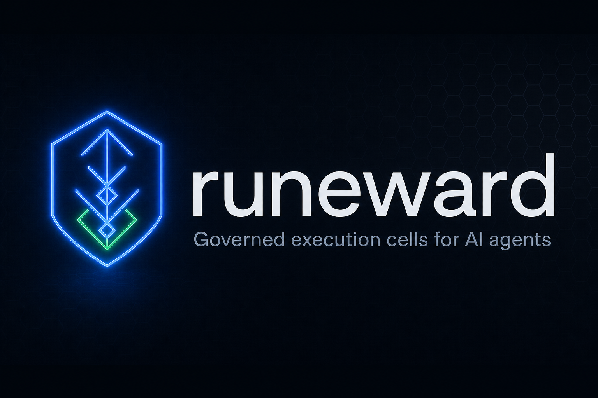

# runeward

<p align="center">
  
</p>

**Governed execution cells for AI agents.**

Declarative profiles provision isolated sandboxes (Docker or Kubernetes) with
deny-by-default egress, a tamper-evident audit ledger, human-in-the-loop policy
gates, and cost/loop guardrails — driven over REST, MCP, a CLI, and a web
dashboard.

## Install

```bash
curl -fsSL https://raw.githubusercontent.com/adefemi171/runeward/main/install.sh | sh
```

Homebrew, container images, and building from source are covered in
[Install](install.md). Then jump to the [Quickstart](quickstart.md).

## Why runeward

Letting an AI agent run shell commands, edit files, install packages, and hit the
network is useful right up until it `rm -rf`s the wrong directory, exfiltrates a
secret, or burns your API budget in a retry loop. Raw isolation ("jail the agent
in a box") is table stakes. runeward adds the governance layer *around* the box —
enforcing the rules outside the model instead of hoping it was trained to behave
([why governance, not training](why-governance.md)):

- **Profiles are a security contract.** Everything you don't grant is denied by
  default, so the blast radius is explicit.
- **Governed, not just isolated.** Every action flows through one path — policy,
  approval gate, guardrails, backend exec, audit ledger — whether it arrives via
  REST, the dashboard, or MCP.
- **Tamper-evident by construction.** An append-only, hash-chained, ed25519-signed
  ledger records every call and its verdict, and exports as an independently
  verifiable transcript.
- **Human-in-the-loop where it matters.** Per-action `allow` / `deny` /
  `require-approval` verdicts pause risky operations for an operator.
- **Cost and loop guardrails.** Hard caps on wall-clock, exec count, and egress
  requests, plus retry-loop detection.
- **Pluggable backends.** Docker/Podman for zero-setup laptop use, or Kubernetes
  (strict L3 egress, CRDs, admission webhook) for production and fleets.

## How it compares

|                                    | typical agent sandbox | runeward                                      |
| ---------------------------------- | --------------------- | --------------------------------------------- |
| Isolation (container/VM)           | yes                   | yes (Docker or Kubernetes)                    |
| Deny-by-default network egress     | sometimes             | yes; SNI allowlist, strict L3 on k8s          |
| Per-action policy + approvals      | rare                  | yes; builtin / CEL / OPA-Rego + HITL gates    |
| Tamper-evident, signed audit trail | rare                  | yes; hash-chained + ed25519, verifiable       |
| Cost / loop guardrails             | rare                  | yes; wall-clock, exec, egress, loop caps      |
| Multi-agent fleets                 | rare                  | yes; N cells + atomic task board              |
| Agent-native surface               | partial               | REST + MCP + CLI + dashboard + SKILL/adapters |
| Signed release artifacts           | rare                  | yes; cosign keyless + SBOMs                    |
| Operable as a service              | rare                  | yes; `/metrics` + structured logs             |

## Where to next

<div class="grid cards" markdown>

- :material-scale-balance: **[Why governance](why-governance.md)** — enforce rules outside the model, not by training it.
- :material-download: **[Install](install.md)** — one-line installer, Homebrew, or from source.
- :material-rocket-launch: **[Quickstart](quickstart.md)** — a governed sandbox in ~60 seconds.
- :material-lightbulb: **[Concepts](concepts.md)** — sandboxes, fleets, policy, egress, the ledger.
- :material-file-cog: **[Profiles](profiles.md)** — the declarative security contract.
- :material-shield-lock: **[Security model](security-model.md)** — what runeward does and does not protect.
- :material-chart-line: **[Observability](observability.md)** — metrics, structured logs, and telemetry.

</div>

runeward is open source under the [Apache License 2.0](https://github.com/adefemi171/runeward/blob/main/LICENSE).
